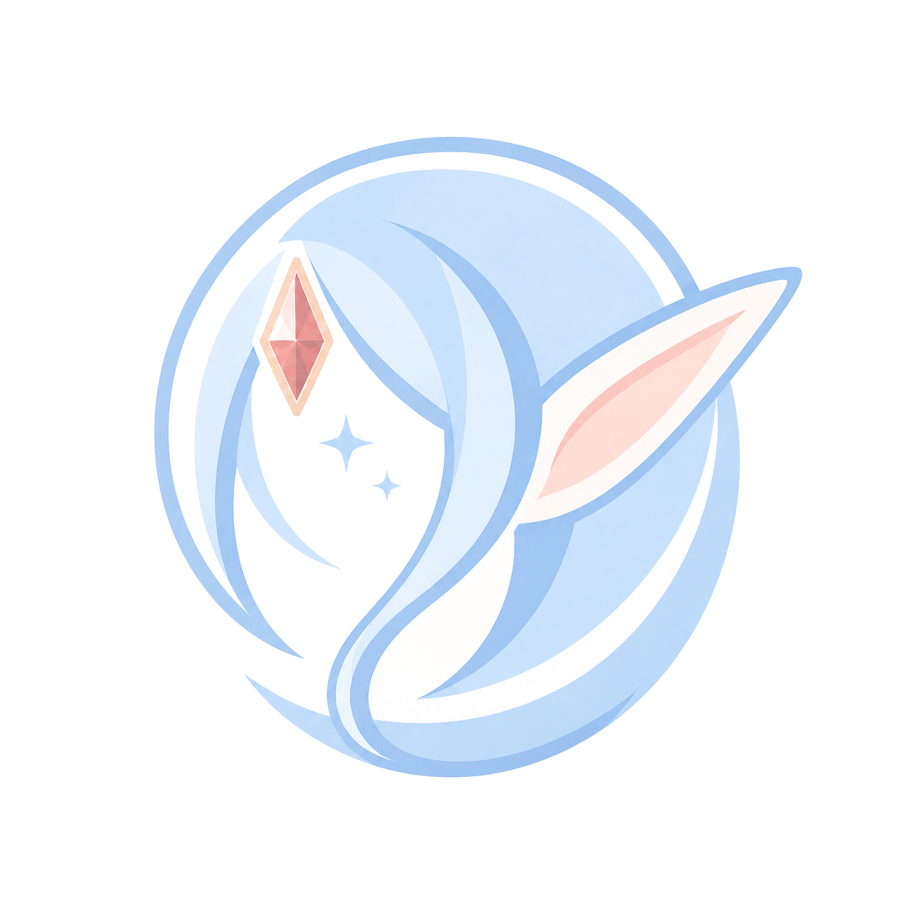

<div align="center">



<sub>**INK & SAKURA · 墨と桜 · DESIGN SYSTEM v2**</sub>

</div>

# 浅仪式 · Asashiki Design System  v2

> **墨と桜 · Ink & Sakura** —— 白底为主，印象色只在该出现的地方出现。

一套为个人 AI 项目设计的视觉规范。v2 在 v1（樱羽四季）基础上**重心位移**：默认从「樱粉主导」改为**中性墨白为底、樱粉作克制点缀**；四季配色降级为可选的「印象色补丁」；引入一款衬线 webfont 承担「编辑感 / 惊艳」。目标气质：**清爽、清新、专注内容，带一点（而非满溢）二次元温度** —— 既能撑正经的项目展示页，也不违和于随手写的动画观后感。

---

## 一、品牌与产品语境

**Asashiki（浅仪式）** 是一个人的 AI 工具作者品牌：做一组让 AI agent 在对话里更有用的小系统 —— MCP 服务、设备时间线、个人数据归档，以及一个安静的博客。这套设计系统在所有这些页面里复用。

代表性产品 / 表面：
- **项目展示站** `show.asashiki.com` —— MCP 工具的卡片式落地页（本系统的旗舰消费方）。本仓库 `ui_kits/showcase/` 即其 v2 复刻。
- **博客** `asashiki.com`（Astro）—— 随笔 / 观影长文，编辑式衬线排版。见 `ui_kits/blog/`。
- MCP 工具：sticker / voice / music / reel-rando / device-timeline 等，多为对话内交互组件 + 网页后台。

### 输入来源（供读者深入考据）
- **设计系统原仓库**：<https://github.com/asashiki/asashiki-design> —— v1 的 tokens、DESIGN.md、SCALE.md、showcase 样板间。**强烈建议想基于本品牌做设计的人先读它**，理解四季配色与 −12° 斜切的来由。
- **展示站**：<https://github.com/asashiki/show> —— 旗舰落地页源码与 PLAYBOOK。
- **博客**：<https://github.com/asashiki/asashiki> （Astro）
- **作者全部仓库**：<https://github.com/asashiki>
- **新 logo**：本仓库 `assets/brand/`（用户重新设计，樱羽人鱼/兔耳主视觉）。

> 不假设读者能访问以上链接；若能访问，按上面顺序读会更快进入状态。

---

## 二、内容基调 CONTENT FUNDAMENTALS

**人称与语气。** 第一人称「我」写随笔与观点（博客），第二人称「你」少量用于引导。产品文案多为**无人称的陈述句**（「让 AI 在对话里发表情包」），动词开头、短促、克制。不喊口号、不用感叹号堆叠。

**casing。** 中文为主，拉丁副名/eyebrow 用**全大写 + 字间距**（`PROJECTS`、`LIVE DEMOS`）。代码、ID、域名、时间戳一律 `mono`。英文专有名小写保留原样（`mcp-switch`、`asashiki-design`）。

**双语混排。** 中日/中英同字号，靠留白和颜色分层，不靠加粗。日文偶尔出现在大标题做气氛（`データは静かに目を覚ます`），不滥用。

**vibe。** 安静、松弛、专注内容。像清晨的第一杯水。**避免**：营销腔、惊叹号、「赋能/打造/一站式」黑话、把功能写成卖点。**示例对照**：
- ✅「把工具，放进对话里。」　❌「革命性 AI 工具生态，一站式赋能你的工作流！」
- ✅「这一刻值得被记住。」　❌「极致体验，触手可及！」

**emoji。** v1 展示站用过 emoji 当卡片图标（🔀🌸🔊）——**v2 明确弃用**，改 Lucide 线条图标。emoji 至多在列表头像等小处点缀，绝不作主视觉。

---

## 三、视觉基础 VISUAL FOUNDATIONS

**底色 / 色相。** 骨架层（`--bg` / `--surface` / `--border` / `--text`）一律**中性暖灰**，无色相倾向，给人专业、干净的第一印象。印象色（樱粉 `--accent`）**面积 ≤ 屏幕 12%**，只出现在主按钮、链接、焦点环、小标记、eyebrow 色块。一屏出现大面积粉 = 廉价手游感，立刻收回。

**字体。** 两套字族并用：
- `--font`（系统无衬线栈）承担**所有 UI 与正文**——快、原生、中日友好。
- `--font-serif`（**Newsreader**，唯一 webfont）只给 **hero 大标题、区块标题、博客长文 prose、大引用**——衬线在大字号 + 略轻字重(500) 下最优雅，是「惊艳/文学」的来源。
- `--mono`（系统等宽栈）给数字 / ID / 时间戳 / 代码。
> ⚠ **字体替换说明**：v1 是纯系统栈。v2 为提升专业/编辑感，新增 Newsreader（Google Fonts 加载）。若你有自托管 ttf 想替换，改 `tokens/fonts.css` 即可，其余 token 不变。CJK 仍走系统衬线（苹方/思源），不加载 CJK webfont（体积太大，违背「清爽」）。

**间距。** 4px 基准，13 档（`--sp-1`…`--sp-13` = 2…96px）。卡片内距 `--sp-6`，区块间距 `--sp-9/10`。

**背景。** 以**大面积留白**为主，不用整屏渐变、不用花哨纹理。唯一的「光」是 `--glow-wash`：一抹**同源浅樱的柔光晕**（径向，向透明渐隐），只用于 hero 角落 / 卡片顶部光带，**单屏 ≤ 2 处**。这不是双拼撞色渐变——红线见下。

**圆角。** 只用三档：`--radius-s 7px` / `--radius-m 10px`（按钮输入）/ `--radius-l 14px`（卡片）+ `--radius-full`（头像/徽章）。**超过 14px 即廉价胶囊感，禁用。**

**边框 / 阴影。** **靠 1px `--border`（中性暖灰 hairline）分层，不靠重阴影。** 阴影只给「真正抬升」的元素（卡片 raised、弹层、按钮 hover），用 `--shadow` 家族（xs/s/m/l），色调为暖中性透明黑。

**卡片长相。** `--surface` 白底 + 1px `--border` + `--radius-l` + 可选 `--shadow`。装饰可选：右上角 `--stripe` 斜纹条（≤ 84px）、顶部 `--glow-wash` 光带。hover 时边框转 `--border-strong` + 抬升 2px。

**hover / press。**
- hover：浅底元素 → `--bg-tint`；主按钮 → `--accent-hover` + 上移 1px + 阴影；链接 → `--accent`。
- press/active：主按钮 → `--accent-active` + 复位（不再上移、去阴影）；开关/勾选用弹性缓动 `--ease-spring`。
- **不用**：press 时整体缩小、彩色光晕脉冲这类「玩具感」反馈。

**动画。** 动效服务信息，不做装饰。时长 5 档（80/160/240/400/600ms），缓动 4 条（default/spring/out/in），**spring 回弹很克制**（cubic-bezier 末端 1.12，非 1.3+ 的弹跳）。淡入 + 轻微上移是默认入场。无限循环装饰动画仅限 skeleton shimmer。全局尊重 `prefers-reduced-motion`。

**透明与模糊。** 仅吸顶导航 / 浮层用 `--surface-overlay` + `backdrop-filter: blur(14px)`。正文区不用毛玻璃。

**imagery 色调。** 主视觉 logo 是**冷调浅蓝**人鱼/兔耳，配樱粉耳鳍与红宝石——清新而非甜腻，正好与暖中性骨架互补。配图建议偏冷、低饱和、留白多。

**深色模式硬规则。** 印象底色（`--bg-tint*`）在深底上必须**一眼说得出色相**（粉就是粉、靛蓝就是靛蓝）；说不出 = 坏档，调亮调饱和、不改色相。

---

## 四、−12° 斜切 · Signature

`--skew: -12deg` 是全站唯一记忆点。**一屏 ≤ 3 处**，只用在：eyebrow 小色块 / 状态标签（SYNCED、LIVE，外层斜切内层文字反向摆正）/ 进度条尾端切角 / 卡片右上斜纹条 / logo。多了就乱。

---

## 五、图标 ICONOGRAPHY

**禁止 AI 手画 SVG 图标。** 一律用成熟图标库，`currentColor` 继承文字色：

| 库 | 何时用 | 用法 |
|---|---|---|
| **Lucide**（首选） | 默认全用它 · 1600+ 线条图标 · shadcn/ui 原生搭档 | CDN `unpkg.com/lucide` + `<i data-lucide="name">` → `lucide.createIcons()`；React 用 `lucide-react` |
| Tabler | Lucide 缺某图标时同风格补充（5900+） | `@tabler/icons-react` |
| Iconify | 兜底聚合，找冷门品牌 logo | `iconify-icon` web component |

规则：描边 1.5–2px、尺寸只用 **16 / 20 / 24px**、颜色 `currentColor` 或 `--text-2` / `--accent`，**不加渐变和阴影**。一套界面只混用风格一致的线条图标。**emoji 不作图标**（v1 展示站的 🔀🌸 已在 v2 全部替换为 Lucide）。

**资产。** 品牌 logo 在 `assets/brand/`：彩色版 `asashiki-mark-color.png` / 墨线版 `asashiki-mark-ink.png`，及各自去白底透明版 `*-t.png`（可置于任意底色）。无内置图标字体；项目图标走 Lucide CDN。

---

## 六、外部复用资源（不重复造轮子）

- **组件结构**：本规范是**皮肤层**。生产项目可直接用 Tailwind + shadcn/ui（Radix 无头组件），只把颜色/圆角/字体换成本系统变量。
- **图标**：Lucide（见上）。
- **动效**：优先纯 CSS transition/animation；复杂编排用 Motion（原 framer-motion）。
- **图表**：Chart.js（轻）或 ECharts（重型仪表盘），颜色仍从 tokens 取。

---

## 七、红线（出现即判定「像 AI / 像廉价游戏」）

- ❌ **大面积渐变背景 / 渐变按钮**；尤其 ❌ **双拼撞色渐变**（如 `linear-gradient(粉, 紫蓝)` ——v1 进度条就犯过，v2 已改单色实填）。`--glow-wash` 同源柔光除外。
- ❌ 强调色铺满卡片 / 导航栏（accent ≤ 12%）
- ❌ 圆角超过 14px 的胶囊感滥用
- ❌ 粗描边 + 高饱和 + 高密度堆叠（典型廉价二次元感）
- ❌ 用阴影代替留白来硬撑层级
- ❌ emoji 当主视觉
- ❌ AI 自造 SVG 图标 / 混用不一致图标
- ❌ 深色模式下印象底色与黑底混同（说不出色相 = 坏档）
- ❌ 营销腔文案、感叹号堆叠

---

## 八、文件索引 INDEX

```
asashiki-design-system/
├── styles.css                  ← 唯一入口：消费方只 link 这一个文件
├── tokens/
│   ├── colors.css              中性骨架 + 樱粉点缀 + 四季/墨 配色补丁（light/dark）
│   ├── typography.css          无衬线字阶 + 衬线 display 字阶 + mono
│   ├── fonts.css               Newsreader webfont（@import）
│   └── scale.css               间距/圆角/z-index/动效/宽度/−12°
├── components/
│   ├── components.css           皮肤层语义类（ad-* 前缀）
│   ├── forms/      Button · IconButton · Input · Textarea · Select · Checkbox · Switch
│   ├── data/       Card · Badge · Tag · Avatar · Progress · Stat
│   └── feedback/   Tabs · Segmented · Tooltip · Dialog · Eyebrow · SectionHead
├── ui_kits/
│   ├── showcase/   项目展示站 v2 复刻（show.asashiki.com）
│   └── blog/       博客长文阅读页（编辑式衬线）
├── guidelines/     16 张基础规范卡（Design System 标签页）
├── assets/brand/   logo（彩色 / 墨线 / 透明版）
├── readme.md       本文件
└── SKILL.md        Agent Skill 入口（可下载进 Claude Code）
```

**组件**（19 个，React 薄包装 + `.d.ts` 契约）：见 `components/<group>/`。每个目录有一张 `@dsCard` 卡片演示全部状态。
**消费方接入**：`<link rel="stylesheet" href="…/styles.css">` → 根元素 `data-theme="light|dark"` + 可选 `data-palette="sakura|sumi|moss|mikan|frost"`（缺省樱羽）→ 用 `ad-*` class 或从 `_ds_bundle.js` 取 React 组件。

---

*v2 · 墨と桜。实战中「看起来不对」的地方，就是这里没覆盖的 case，回头补进第七节红线。*
